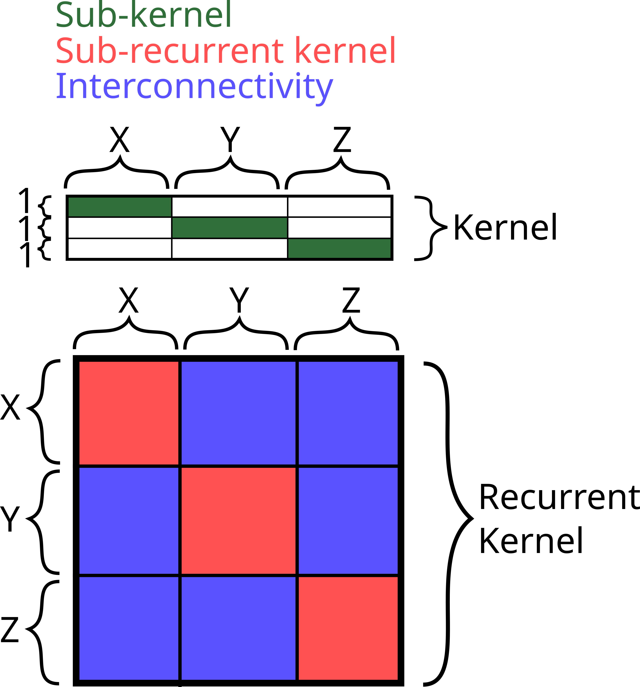

# IRESNs

Questa libreria permette di costruire modelli di tipo ESN usando tensorflow.

Modelli supportati:

 - ESN (Echo State Network)
 - IRESN (Input Routed ESN)
 - IIRESN (Interconnected Input Routed ESN)

Codice di esempio con spiegazione in `main.ipynb`

Libreria utilizzata in questo progetto: https://github.com/SilverLuke/Tesi

# Funzionamento

Come visualizzare la creazione del reservoir, per i modelli IRESN, IIRESN:

Nella figura i valori x, y e z fanno riferimento a quanti elementi è sono composti i sub-reservoir, 
quindi per il numero di unita presenti nel kernel e nel recurrent kernel. Nella figura cono presenti 3 sub-reservoir,
ma possono essere costruiti modelli da 2 o più sub-reservoir.

Il numero di "righe" del kernel dipende dalle `Ny` feature di cui è composto il dataset, analogamente per il numero di 
tagli verticali della matrice. Le unità `Nx` vengono equidistribuite tra tutti i sub-reservoir di conseguenza -> x + y + z = `Nx`.
Questo comportamento può essere mutato se viene fornito un vettore di iperparametri, rappresentante il partizionamento delle unità
tra i sub-reservoir, ai modelli Input Routed.

Nel kernel le sotto matrici non diagonali (quelle non verdi) sono settate a 0, mentre le sotto matrici diagonali (verdi) 
vengono inizializzate tramite `tf.keras.initalizers.RandomUniform()`.

Il recurrent kernel viene diviso in `Ny*Ny` sotto matrici, le matrici sulla diagonale (rosse) rappresentano il recurrent kernel del sub-reservoir
, quindi sono quadrate. Vengono scalate tramite il raggio spettrale e ognuna può avere un raggio spettrale distinto.
Le off-diagonali (blu) possono non essere quadrate, per questo motivo non è possibile utilizzare il raggio spettrale per
normalizzare queste matrici.

